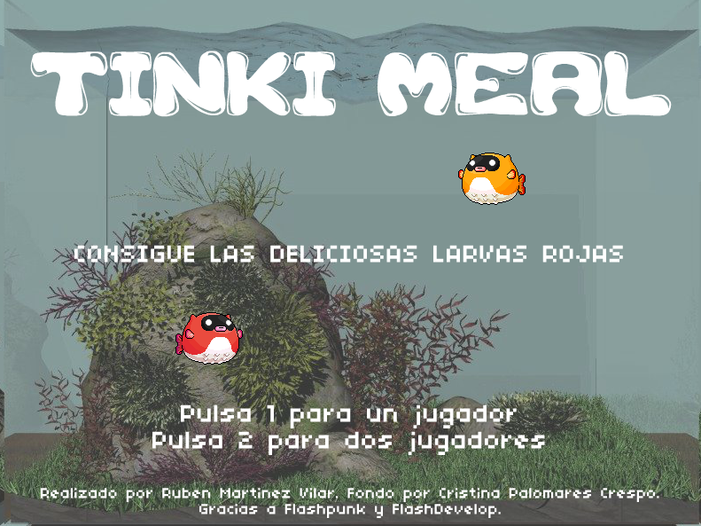

Tinki Meal
==========

Flash game. It's meal time for Tinki the fish!

This is a little game I made just to learn Actionscript and the fantastic Flashpunk library (http://useflashpunk.net/).
I highly recommend the FlashDevelop IDE (http://www.flashdevelop.org/) to open this project, check the source code and learn the basics of game programming with flash.

